# Assignment 1: Rimless Wheel Dynamics and Stability Analysis

**Author: Riley Link**  
**Date: 9/9/2026**  

---

## 1. Problem Setup

The goal of assignment 1 is to model the rimless wheel. This model will have collisions and thus have hybrid dynamics. Along with this challenging dynamics problem, our goal is to analyze the stability of the model using a region of attraction to analyze initial conditions along with a Poincare section to see where fixed points/limit cycles occur.

## 2 Modeling the Rimless Wheel

To model the spokeless wheel, I first chose the coordinate system shown in the image below.

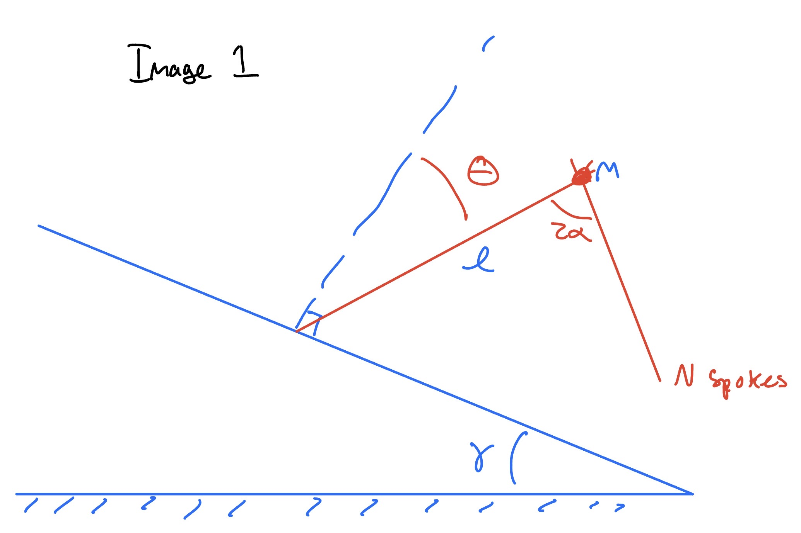

In this image, we can see that we model the rimless wheel as an inverted pendulum with theta, $\theta$, denoting the angle between the normal vertical and the pendulum (which has mass $m$). The angle gamma, $\gamma$, is the inclination angle of the ramp. For $N\in\mathbb{N}$ spokes, the angle between the spokes is denotes as $2\alpha$. The length of the spokes are each length $\ell$.

 **We want to emphasize that our vertical is always taken normal to the ramp. So for $\gamma > 0$ this does not match the y-axis vertical. This is simply the choice made when modeling**.

 To model the dynamics, we take the state,
 $$x = [\theta,\dot{\theta}],$$
 and thus we wish to find a vector field $f$ such that $\dot{x} = f(x)$ where $\dot{x} = [\dot{theta},\ddot{\theta}]$. 

 To derive the dynamics, we use the standard inverted pendulum dynamics, but we have to realize that the angle relative to the gravitational vertical is actually $\theta+\gamma$ as see below:

 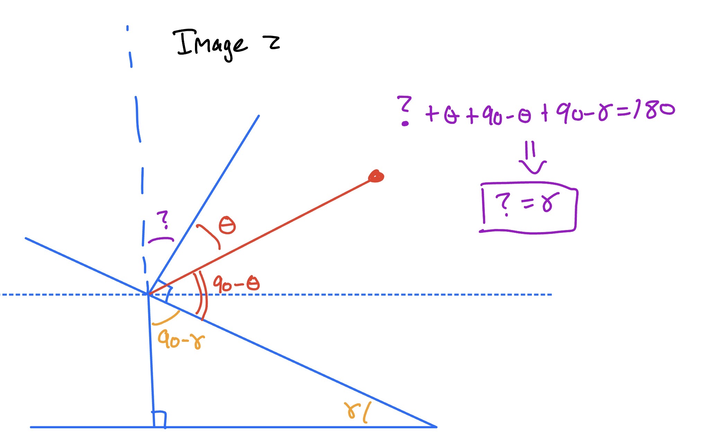

 Therefore we have the equation of motion,
 $$m\ell^2 \ddot{\theta}-mg\ell\sin(\theta+\gamma),$$
 where $g=9.81$ is gravity.

Therefore, the state-space dynamics are:
$$
\dot{\mathbf{x}}
=
\begin{bmatrix}
\dot{\theta} \\
\frac{g}{l}\sin(\theta+\gamma)
\end{bmatrix}.
$$

### 2.1 Energy of the inverted pendulum
The velocity of the point mass is:
$$
v=l\dot{\theta}.
$$
The kinetic energy is:
$$
T
=
\frac{1}{2}ml^2\dot{\theta}^2.
$$

The potential energy is:
$$
V
=
mgl\cos(\theta+\gamma).
$$

The total energy of the system is $E = T+V$.

### 2.2 Collision Mechanics

To model this rimless wheel walking down the ramp, we must define the mechanics at the collision point. In a short summary, at the point when both spokes are on the group, i.e. the collision, there are two velocity vectors. One, for the pre collision velocity of the mass falling downward. That will continue to point down the slope. Then, there is a second velocity vector now pointing perpendicular to the new spoke that we will be riding on. Below shows the collision point:

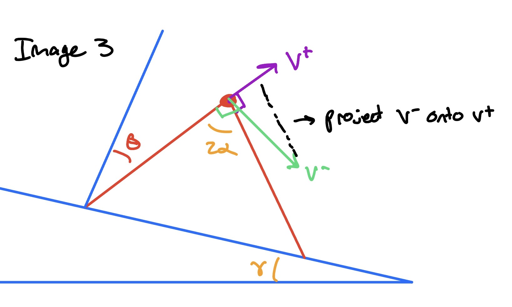

By conservation of momentum, $H^+ = H^-$. This means that we must project $v^-$ onto the $v^+$ direction to see how much is preserved. Since the angle between them is $2\alpha$ then $H^- = \ell m v^- \cos(2\alpha)$ and $H^+ = \ell m v^+$. Therefore, setting them equal and cancelling out the constants we have,
$$v^+ = v^- \cos(2\alpha).$$

Since $v = \ell \dot{\theta}$ we conclude that $\dot{\theta}^+ = \dot{\theta}^- \cos(2\alpha)$.

Now, we must figure out where this collision is occuring so we can implement an event checker. If we take the triangle below, we can solve to see that two spokes are only on the ground whenever $\theta = \pm \alpha$. This will be our event checking condition.

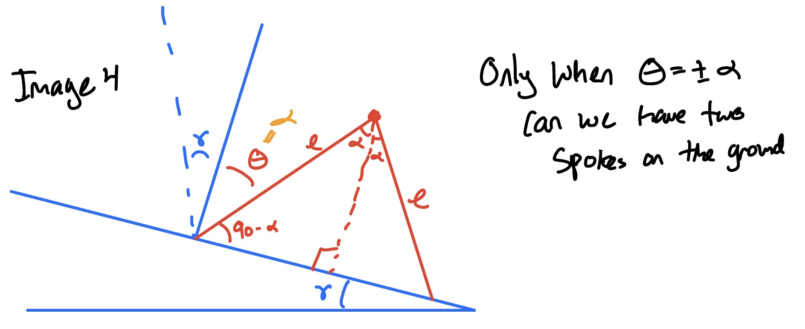

Finally, we note that collisions can occur forward and backwards. A forward collision occurs when $\theta\geq\alpha$ and to reset these dynamics we need to subtract $2\alpha$. However, if we have a backward collision, meaning $\theta \leq -\alpha$ then we need to reset by adding $2\alpha$.

### 2.3 Complete Hybrid Model

The model consists of:
1. Continuous inverted-pendulum dynamics between collisions.
2. Event detection at $\theta=\pm\alpha$.
3. An instantaneous angle and angular-velocity reset at each collision.

---

## 3. Sanity Checks

To check to make sure that my model was accurate I did a total of 4 things. In this section we will show how these sanity checks help analyze a situation of $x_0 = [-\alpha, -3]$ $N=9$, and $\gamma=10$ degrees.

### 3.1 Plotting the pendulums path

The first sanity check I did was to simply plot the pendulums path. Unfortuntately, this method did not turn out well. Since the pendulum is constantly resetting angles, the path is just the same line drawn over itself over and over. Therefore, to fix this I implemented an animation function that helped me see where the pendulum was actually going. 

Once again, this still had downsides as our frame of perspective is not changing and the other spokes are not plotted, so it looks like the pendulum is resetting positions and jumping everywhere, but it does help me see what is going on.

This animation was particularly useful when analyzing the Poincare plots as I was confused about seeing certain dots that trailed the identity line before it jumped into a rocking motion. The animation helped me see that these dots came from the initial velocity boost which eventually slows down and we get to that rocking motion.

### 3.2 Energy Plots

The second sanity check I used was energy plots, like those from assignment 0. A sample energy plot is shown below:

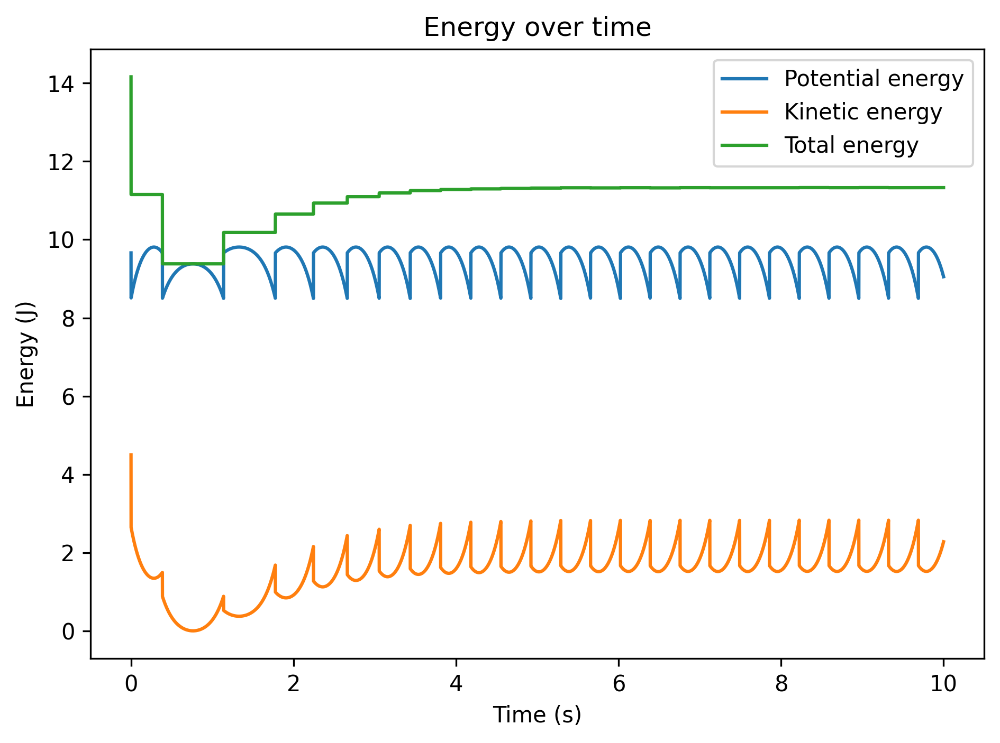

Analyzing an image like this really helped me see what was happening. Just looking at the potential energy here, we see that it is rising in the first hump, meaning we must be falling backwards, up the slope so that our mass is rising in height. However, we quickly see this change into a patter of a vertical reset and then falling potential energy. Kinetic energy mirrors this, as the pattern it reaches is rising kinetic energy before it is shifted down.

This matches the expectation for the inital conditions given of $x_0 = [-\alpha, -3]$ meaning it starts with velocity pushing it up the hill. However, we quickly start falling back down and reach that steady walking gait as shown by the pattern we see in the energy. We also see that our total energy levels off, showing that we have reached a point where energy is conserved, i.e. a limit cycle.

Therefore, through this type of analysis, I was able to debug many issues simply by looking at what pattern was observed in the energy to determine if I was hitting a limit cycle or not.

### 3.3 Phase Portraits

The third sanity check I used was phase portraits. Unfortunately, these were difficult to read. Below is the phase portrait for our example.

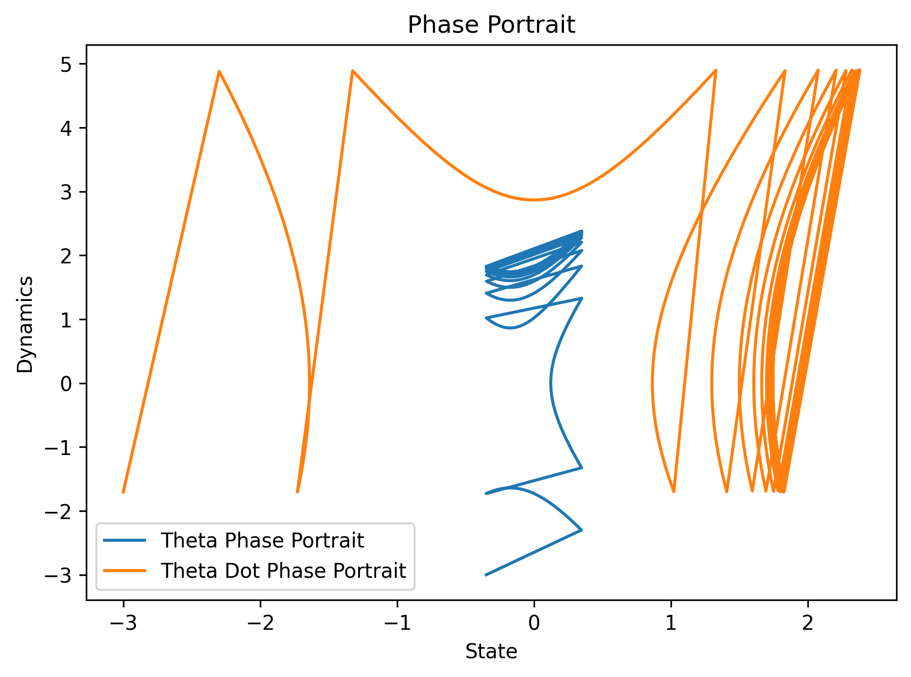

The blue line shows theta vs theta dot. It is easy to see that this stays contained in the column of $-\alpha$ to $+\alpha$. We are able to see that everytime we jump back to $-\alpha$ from a forward collision occuring, our velocity decreases (which is what we would expect since $\cos(2\alpha) must be less than 1). 

This phenonmenon can also be seen in the orange, theta dot vs theta double dot line. This line is very similar to the blue, simply because the x-axis of the orange is equal to the y-axis of the blue, i.e. they are both $\dot{\theta}$. The orange line jumps between velocities at resets and we see that the acceleration decreases with every collision, which is what we would expect since we are losing some velocity.

The real value in these plots come from just looking at the end of the trajectories and where we end up. As we can see in both of these, the final path is deeply shaded, meaning it hits that over and over. This indicates instantly that we have reached a limit cycle and since the velocity is positive, this is our walking limit cycle.

### 3.4 Poincare Section Plots

The last tool I used to help with sanity checks was the Poincare section plots. I will go into more detail later on how we make these, but they truly are a super useful and quick tool to see what is happening.

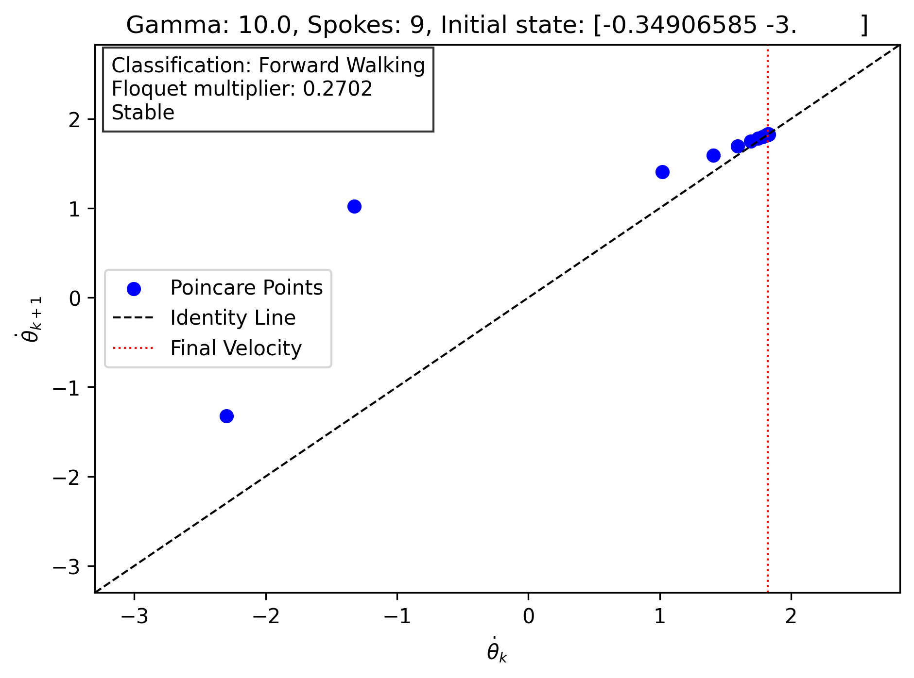

The plot above shows us instantly that we approach a place on the identity line, meaning that we hit some attractor. Since our velocity is positive, that means we have hit the walking attractor and our velocity is not changing at each collision point. Additionally, the Floquet multiplier also tells us this is the stable attractor. 

These plots were super useful when I wanted to simply see what was happening with the walker. For example, if I had a problem where my velocities were not going to 0 but they were close, I was able to tell long term whether we were just taking awhile to hit the walking gait or if we were stuck in some rocking motion. This helped me build my classification function throughout!

## 4. Discussion

In this section we will discuss the results of the assignment. Note that all plots are put into assignment_1_figures and are not all discussed here, although most cases are covered.

### 4.1 ROA Analysis

To build a brute force region of attraction (ROA) function, I used a couple of things. First, I used a pretty small grid. I ended up choosing only a 25 by 25 grid of the initial conditions $\theta$ and $\dot{\theta}$ since it was simply taking very long. The real issues began with the fact that to iterate over gamma values, N spoke values, and all initial conditions, while integrating using rk4 at 1e-3 timestep AND simulating for 10 seconds to ensure convergence, it was VERY SLOW. In fact, implemented in the function is a time keeping part that prints how long you have left since I was impaitient and wanted to know.

So to actually implement the function, we needed a way to classify the trajectories. The possible classifications are:

- **Rest:** The angular velocity remains below the specified tolerance (0.1 was used) near the end of the simulation.
- **Forward walking:** Recent post-impact angular velocities are positive and converge toward a nonzero value.
- **Not yet converged:** The trajectory does not satisfy either classification within the specified simulation time.

While the "not yet converged" condition does not show up in any plots, it was very useful to try and find the minimum time I must run the simulations (which ended up being 10 seconds) to make sure it all converged.

So, to check if we were at rest, I had to set a high velocity tolerance. The problem is, that as we rock back and forth our velocity is constantly being multiplied by $\cos(2\alpha)$ for every rocking collision. So, theoretically, this converges to 0 and in the real world would send us to rest. However, in simulation, since I didnt want to run it for that long, I had to set my velocity tolerance higher to catch cases of rocking that still had high velocities.

To catch forward walking, while it really is just anything that isnt near 0, we simply checked to make sure the velocities were positive. Since we checked the rest condition first, even if the rocking velocities at impact were positive, if they were small then they should have been caught. **However**, this might be a limitation of my code as there could be conditions where it just takes a long time to kick into that walking condition and therefore it might misinterpret small velocities as at rest when in reality it just hasnt started walking yet. I think this issue is mitigated via running the samples for longer, and I think I ran them long enough, but it should be mentioned.

Initial conditions were chosen for $\theta \in [-\alpha,\alpha]$ (since that is the only ranges theta is allowed in) and $\dot{\theta}\in [-3,3]$. The velocity range was chosen because after trying different velocity ranges, it seemed this one showed most of the characteristics of the others while being at a good resolution.

A couple of the brute ROA plots are shown below for various gamma and spoke values. These images were chosen to illustrate the cases of what we saw happen and do not include all plots created.

#### 4.12 Gamma Illustrations

For these gamma illustrations, the number of spokes has been fixed at 10.

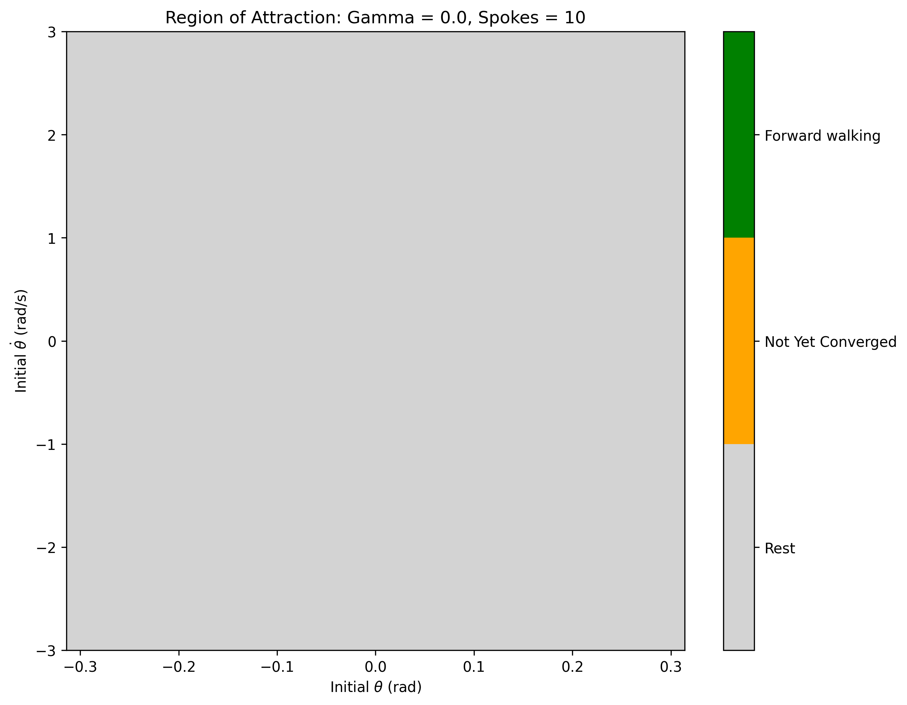
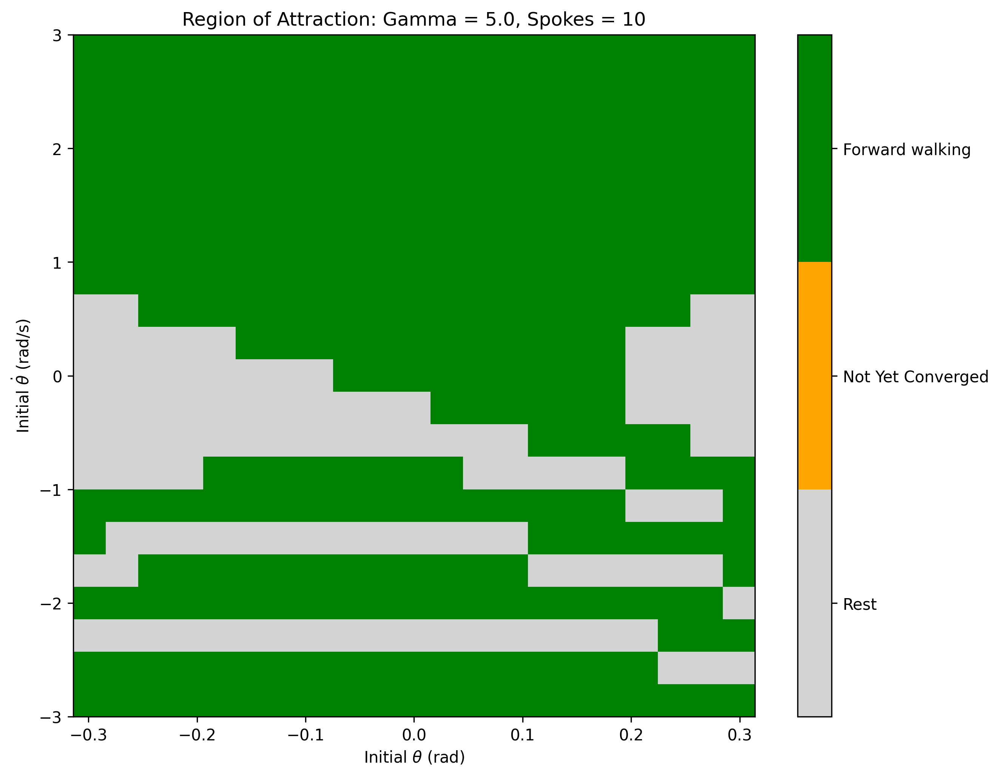
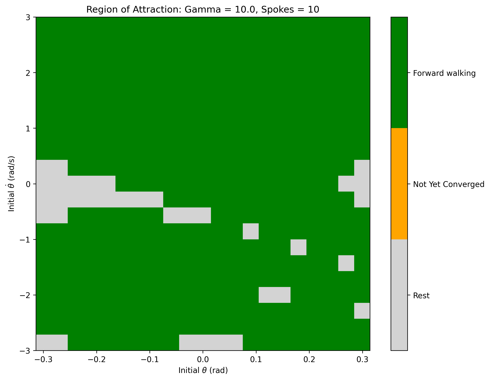
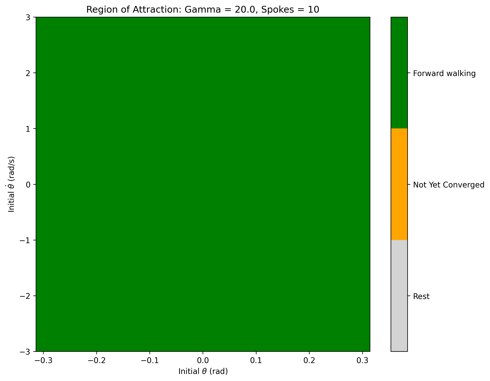
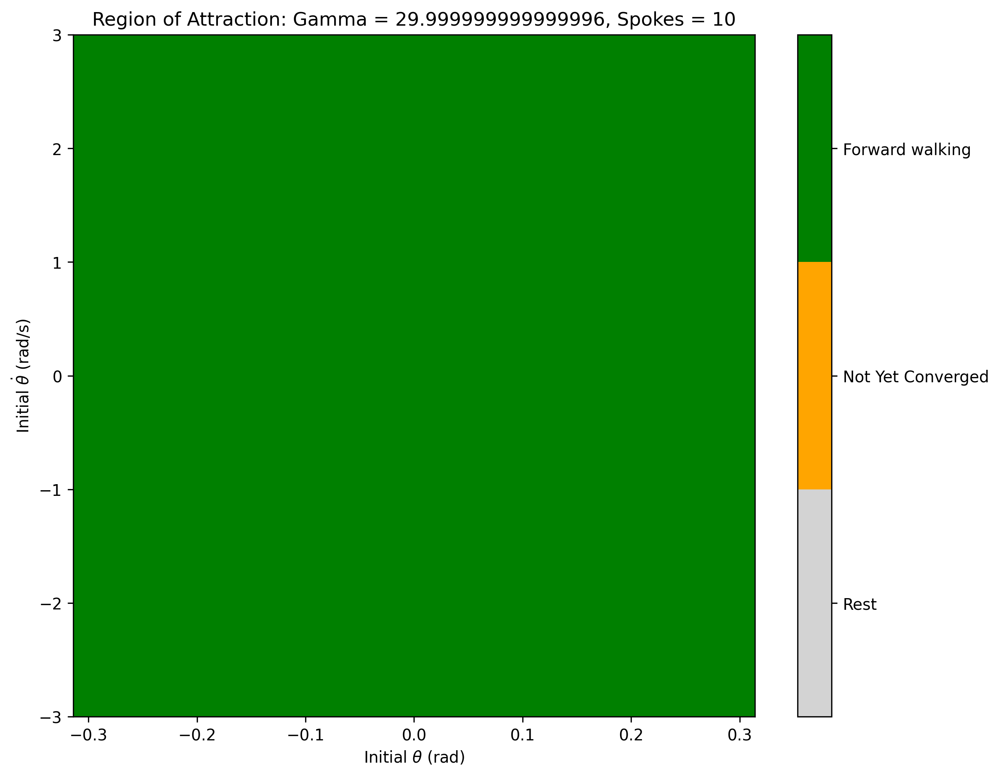

These plots show that as gamma increases, we simply get more walking gait. When gamma is 0, we can never get to a continous walk, which makes perfect sense since we arent able to walk downhill with gravity. Once we increase gamma up to five degrees, we see a large chunk of our plot become green, specifically most positive velocities. This means that once we have some sort of incline, we really just need to be sent forward to start walking. 

Then, as gamma keeps increasing and increasing, the walking limit cycle takes over. This is because that once $\gamma > \alpha$ the resting configuration is impossible. Alpha in this case is pi divided by $N=10$, which is around $18$ degrees. Therefore, we see that for our plots of $20$ and $30$ degrees, since $\gamma > 18$, then the entire plot must be green i.e. go to walking gait. 

#### 4.13 Spoke Illustration

For these spoke illustrations, gamma has been fixed at 10 degrees.

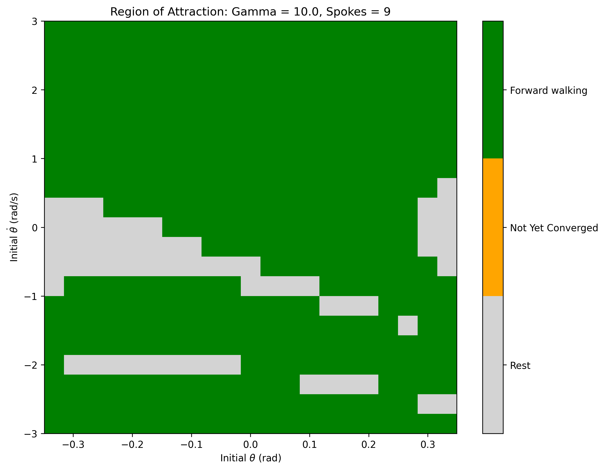

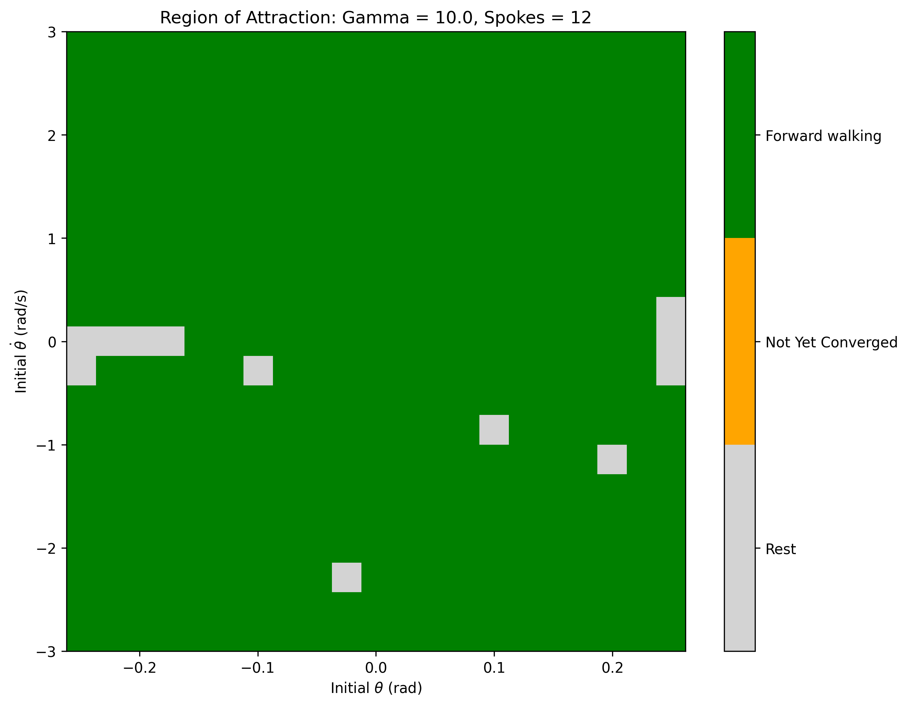

From these we can see that the initial conditions depend greatly on the number of spokes. With just six spokes, it couldnt even get rolling as not a single initial condition was sent to the forward walking. However, as we increase the number of spokes we see more and more of the plot turn green, meaning more initial conditions are sent to walking. 

The interesting part we can analyze is that there is a line forming between the top right section of green and the bottom left section of green. This can be interpreted as the initial conditions that start with a backwards velocity and so their first collision is backwards i.e. up the hill, YET, they do not have enough energy to then send it down the hill walking. However, as you increase the starting negative velocity, we get towards that bottom left section of green, implying that once we have enough energy to kick back off the backwards collision, we can then start walking down the hill.

This is very interseting as we see this bottom left section grow and grow with more spokes, **which makes perfect physical sense!**. Think about what more spokes means if we send it backwards. It means that it will hit sooner rather than with less spokes, meaning it is hitting with higher velocity that can then be switched and sent forward, sending us down the hill towards a walking gait.

### 4.2 Poincare Section Analysis

### 4.21 Definition of the Poincaré Section

For forward walking, the Poincaré section is defined immediately after a forward collision:

$$
\theta=-\alpha,
\qquad
\dot{\theta}>0.
$$

The Poincare return map is:

$$
P(\dot{\theta}_k)
=
\dot{\theta}_{k+1}.
$$

A Poincare plot compares consecutive post-impact velocities:

$$
x=\dot{\theta}_k,
\qquad
y=\dot{\theta}_{k+1}.
$$

The identity line is:

$$
\dot{\theta}_{k+1}
=
\dot{\theta}_k.
$$

Therefore, a plot can show us how the trajectories angular velocity changes across time. We can analyze these plots to see under what conditions do the trajectory points go towards the identity line, implying $P(\dot{\theta}_{k+1}) = \dot{\theta}_k$ i.e. we are at a limit cycle, or if our $\dot{\theta}$ simply decays to zero.

A couple of Poincare plots are shown below to illustrate the different types of plots.

### 4.22 Walking Fixed Point

A forward-walking fixed point satisfies:

$$
P(\dot{\theta}^*)
=
\dot{\theta}^*.
$$

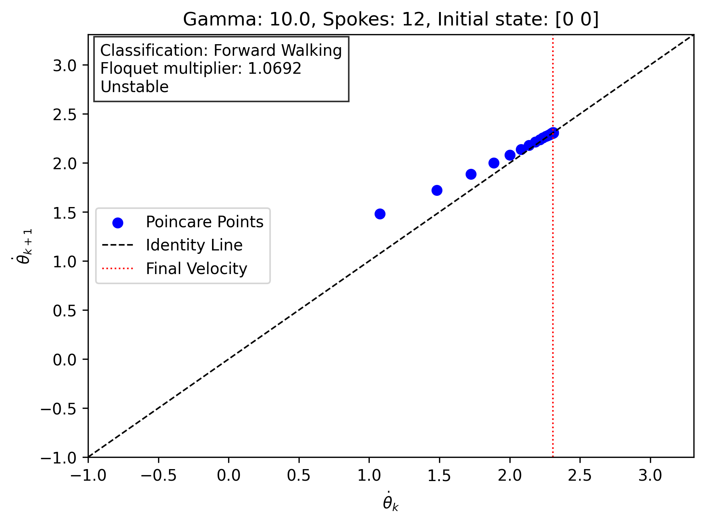

The image shows that our points slowly move tangent to the identity line and the red vertical line shows where the final point occurs. We see large clumps near that final point, indicating that it has reached some limit cycle. Since the velocity is positive, we can conclude that this is the walking fixed point.

### 4.23 Rocking Fixed Point

As mentioned above, we often get into this rocking motion where our velocity is decaying to zero as it is multiplied by $\cos(2\alpha)$. However, it often takes awhile to get there. 

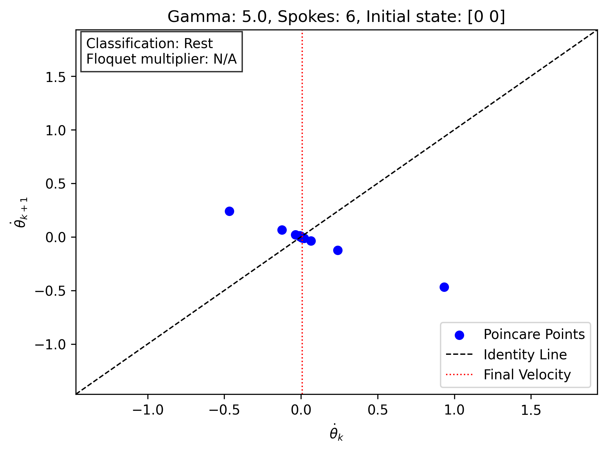

As seen in the image, this creates a diagonal line, mimicking a $y=-x$ line. This is because our velocity is changing directions rapidly as it rocks back and forth. However, we see from the red vertical line that we do reach near zero velocity, even if it takes awhile. 

Some plots like this can be confusing as they can have both this rocking motion and a set of points tangential to the identity. This is where the red line really comes in handy. 

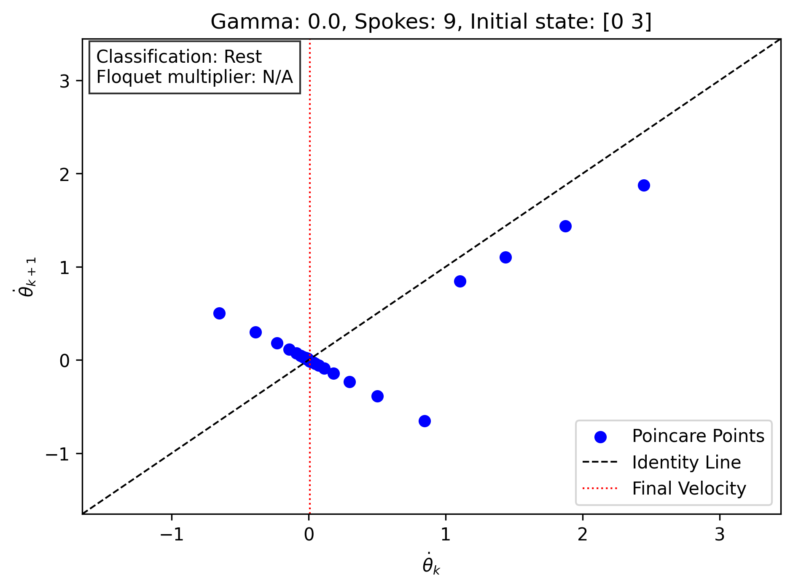

In the above image, we start out with a large positive initial velocity which can send us forward into a sort of walking motion. However, eventually gravity catches up and we are sent back towards the zero equilibrium. So, at first I was confused by this but once we analyze it this way, it is easy to see that this is still going towards a rocking motion i.e. eventually it will be at rest.

For this fixed point, we always classify these as at rest due to the small velocities at the end of its trajectory.

### 4.24 Floquet Multiplier

The scalar Floquet multiplier is the derivative of the return map at the walking fixed point:

$$
\mu
=
P'(\dot{\theta}^*).
$$

We estimate it using a derivative approximation:

$$
\mu
\approx
\frac{
P(\dot{\theta}^*+\epsilon)
-
P(\dot{\theta}^*-\epsilon)
}{
2\epsilon
}.
$$

The stability conditions are:

- $|\mu|<1$: stable walking cycle
- $|\mu|>1$: unstable walking cycle
- $|\mu|=1$: marginally stable walking cycle

Note, in all of our plots, the walking cycle should be stable if we run the trajectory long enough, meaning we see that $|\mu|<1$ always. However, due to numerical error and having to choose epsilon correctly, we may sometimes see an unstable multiplier but I believe that is an error.

If one of these test cases is found where it produces an error please let me know as I believe this can be an issue but I havent found a way to fix it.

### 4.3 Energy based ROA

Finally, as mentioned on the assignment_1.md file, the brute force ROA is SLOW!!! However, there is a much better way of calculating the ROA using energy based methods. Conceptually, we can think of this as classifying whether or not there is enough energy in the system to reach the forward collision with the speed needed to complete another step.

The mathematics for this was referenced from [text](https://underactuated.mit.edu/simple_legs.html#rimless_wheel) by Russ Tedrake.

Below are images of the energy based ROA contrasted with the brute force. The brute force plots have the not yet converged possibility as a way to distinguish them.

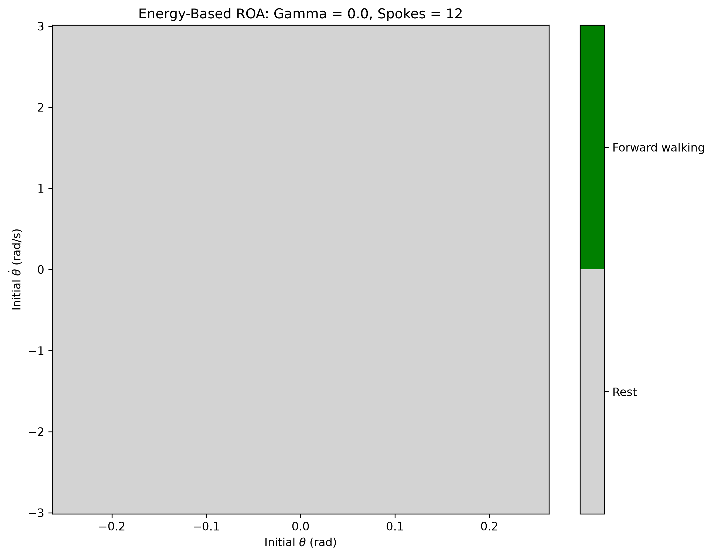
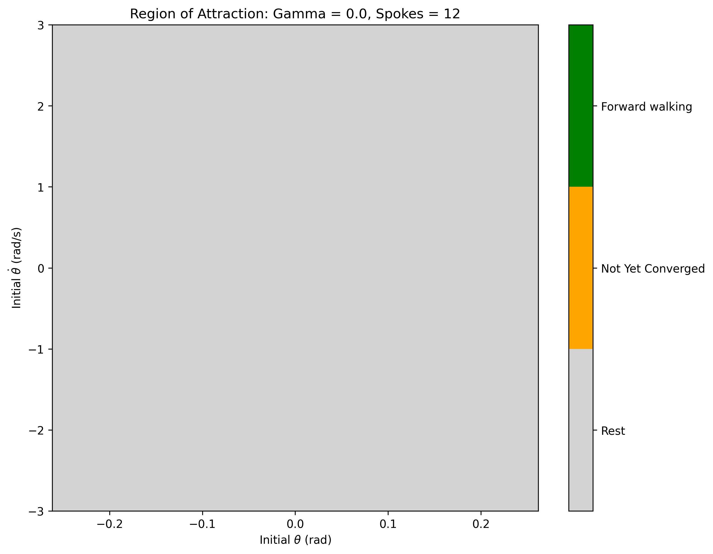

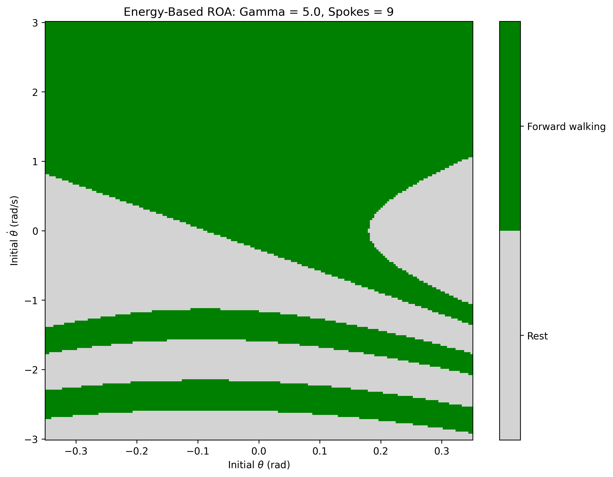
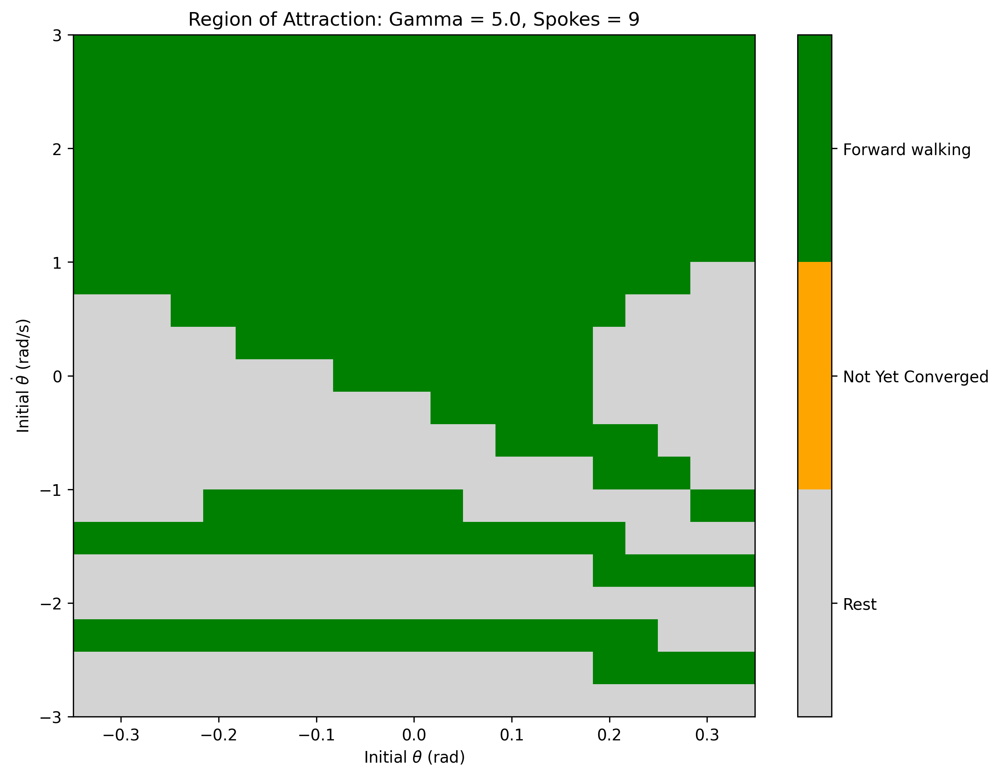

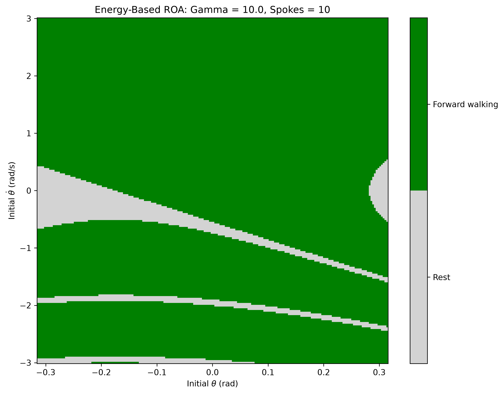

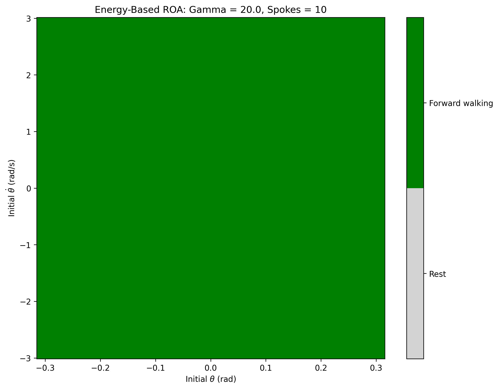

What is interesting is that we see that our brute force plots are very spot on! They both show this separation between the bottom left walking points and the top right walking points, i.e. there is this diagonal line in the middle where even though we can have non-zero velocity and we arent balancing the pendulum in any way, we get that we fall down to a rest and dont have enough energy to kick back up.

However, as gamma grows, we see this go away as it is simply easier to walk down the hill.

This implementation is a HUGE speedup from the brute force and it has much better resolution, although, our analysis from before still holds of course.

## 5. Conclusion

In conclusion of this assignment, there are definitely limitations within my code. I suspect some of the test cases may not appear entirely. Additionally, we see that the brute force ROA is super slow and is not a fine grained plot. 

Our results showed that the more spokes and the larger $\gamma$ was increased the chance that we go to a walking limit cycle. This makes intuitive sense as a larger gamma means we cannot just rest without falling over.

Additionally, we were able to see that our Poincare map sucessfully identified forward walking fixed points and they were super helpful in simple sanity checks.

Finally, a limitation that could be useful for a future direction would be adding friction though I have no clue how to do that.